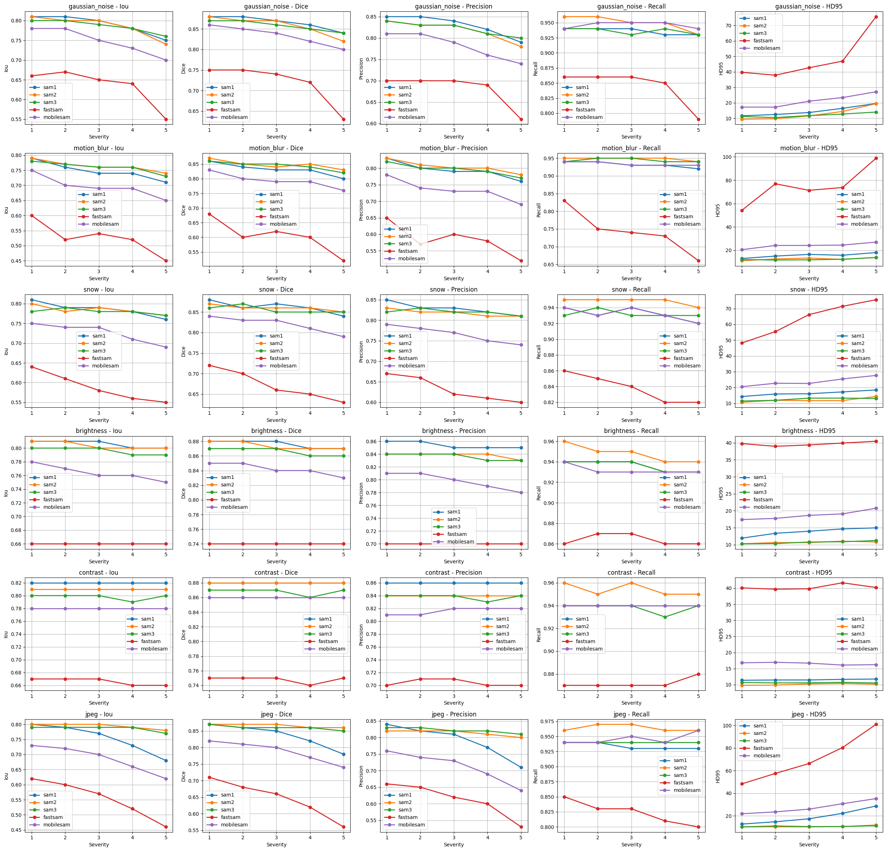

# NoisySAM - Evaluate foundation model robustness under perturbations for natural image segmentation (Ongoing)

This project evaluates the robustness of foundation segmentation models under various image corruptions and perturbations for natural image segmentation tasks.

The main objective is to analyze how segmentation quality degrades when input images are affected by realistic distribution shifts such as noise injection, blur, compression artifacts, illumination changes, and weather-related corruptions.

The benchmark focuses on prompt-based segmentation foundation models and provides a unified evaluation pipeline across multiple datasets, perturbation types, and severity levels.

---

# Implemented Models

The following segmentation foundation models are currently supported:

* SAM
* SAM2
* SAM3
* MobileSAM
* FastSAM

---

# Datasets

Current benchmark datasets:

* VOC2012
* BSDS500
* Stanford Background Dataset

Planned datasets:

* COCO
* Cityscapes
* Medical segmentation datasets

---

# Implemented Perturbations

The benchmark currently supports the following corruption types:

| Category     | Perturbation     |
| ------------ | ---------------- |
| Noise        | Gaussian Noise   |
| Blur         | Motion Blur      |
| Weather      | Snow             |
| Illumination | Brightness       |
| Contrast     | Contrast Shift   |
| Compression  | JPEG Compression |

Each perturbation is evaluated using 5 severity levels.

Example configuration:

```python
NOISES = {
    "none": None,
    "gaussian_noise": gaussian_noise,
    "motion_blur": motion_blur,
    "snow": snow,
    "brightness": brightness,
    "contrast": contrast,
    "jpeg": jpeg,
}
```

---

# Evaluation Pipeline

The evaluation framework follows these steps:

1. Load image and segmentation mask
2. Apply corruption with selected severity
3. Generate prompts from the ground-truth mask
4. Run segmentation inference using foundation models
5. Compute segmentation metrics
6. Aggregate results across the dataset

---

# Prompt Generation Strategy

## Box Prompt Sampling

The current implementation uses box prompts generated directly from connected components in the ground-truth mask.

For each connected region:

1. Extract connected components from the binary mask
2. Compute a tight bounding box around the component
3. Expand the bounding box slightly using an expansion ratio
4. Use the expanded box as the prompt for segmentation inference

This simulates imperfect localization conditions commonly encountered in practical applications.

Example implementation:

```python
def get_box_prompts(mask, expand_ratio=0.02):
    H, W = mask.shape

    expand_x = int(W * expand_ratio)
    expand_y = int(H * expand_ratio)

    boxes = []

    binary = mask.astype(np.uint8)
    num_labels, labels = cv2.connectedComponents(binary)

    for i in range(1, num_labels):

        component = (labels == i)

        ys, xs = np.where(component)

        if len(xs) == 0:
            continue

        x1, x2 = xs.min(), xs.max()
        y1, y2 = ys.min(), ys.max()

        x1 = max(0, x1 - expand_x)
        y1 = max(0, y1 - expand_y)

        x2 = min(W - 1, x2 + expand_x)
        y2 = min(H - 1, y2 + expand_y)

        boxes.append([x1, y1, x2, y2])

    return boxes
```

---

# Inference Procedure

For each object instance:

1. Generate box prompts
2. Run model inference
3. Merge predictions from all prompts
4. Compare prediction against the ground truth
5. Compute evaluation metrics

Example inference loop:

```python
for b in boxes:

    p, _, _ = predictor.predict(
        box=np.array(b),
        multimask_output=False
    )

    if p is None or len(p) == 0:
        continue

    p = p[0]

    if merged_pred is None:
        merged_pred = p
    else:
        merged_pred = np.logical_or(merged_pred, p)
```

---

# Evaluation Metrics

The benchmark currently reports:

* IoU
* Dice Score
* Precision
* Recall
* HD95

Metrics are averaged across all object instances in the dataset.

Example output format:

```json
{
    "noise": "gaussian_noise",
    "severity": 3,
    "model": "sam2",
    "metrics": {
        "Iou": 0.71,
        "Dice": 0.81,
        "Precision": 0.84,
        "Recall": 0.79,
        "HD95": 5.62
    }
}
```

---

# Experimental Results



---

# Running the Benchmark

Example execution:

```bash
python main.py
```

Results are automatically saved to:

```bash
results.json
```

---

# Project Structure

```text
NoisySAM/
│
├── main.py
├── data.py
├── model.py
├── metrics.py
├── noise.py
│
├── results.json
│
├── images/
│   └── results.png
│
└── README.md
```

---

# Future Work

## Additional Models

Planned integrations:

* MedSAM
* MobileSAMv2
* EfficientSAM

---

## Additional Perturbations

Future corruption types:

* MixUp
* CutMix
* CutOut
* Fog
* Rain
* Elastic Distortion

---

## Additional Features

Planned improvements include:

* Medical image robustness benchmarking
* Point and text prompt evaluation
* Cross-dataset generalization analysis
* Robustness visualization dashboard
* Per-class robustness statistics
* Real-world corruption benchmarks
* Inference speed comparison across models

---

# Citation

```bibtex
@misc{noisysam2026,
  title={NoisySAM: Robustness Evaluation of Foundation Segmentation Models Under Image Perturbations},
  author={Khoa Vu Minh},
  year={2026}
}
```
